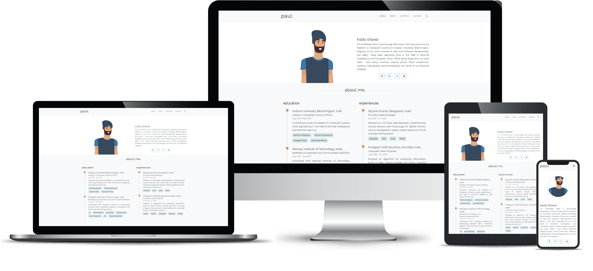

# Welcome to my Portfolio 🖐

> My name is Allan Pereira Abrahão and this is my minimalist personal website.

> I know:
>  >  >  >  >  >  >  > 

<!---->

<!--
 -->

💻 Come see my [Linkedin page](https://www.linkedin.com/in/allanpereiraabrahao/)

## License

- **[MIT license](http://opensource.org/licenses/mit-license.php)**
- Copyright 2021 © <a href="https://github.com/all-an/" target="_blank">Allan Pereira Abrahão</a>
